# XRobot Template -- AI 上下文文档

## 变更记录 (Changelog)

| 日期 | 操作 | 说明 |
|------|------|------|
| 2026-04-30 | 更新 | LibXR 升级至最新版：C++20 基线、FreeRTOS→freertos 目录重命名、新增 RuntimeStringView、Print/Format 重构、libxr_def 常量化（M_PI→LibXR::PI/OFFSET_OF 移除/RawData 语义收紧）；Xro_template 无明显 API 兼容性问题 |
| 2026-04-23 | 新建 | 首次全仓扫描，完成阶段 A/B/C 全量分析 |

---

## 项目愿景

XRobot Template 是一个面向 RoboMaster 竞赛的 **STM32F407 嵌入式机器人控制框架**。项目采用 C11/C++20 混合编程，基于 FreeRTOS 实时操作系统，通过 LibXR 硬件抽象层统一管理外设，实现底盘、云台、发射三大子系统的闭环控制，并内置健康监测、降级策略、功率管理（HKUST 能量环+功率环）、姿态估计（QuaternionEKF）等完整安全与控制机制。

**技术栈**：
- MCU: STM32F407IGH6 (Cortex-M4F, 168MHz, 1MB Flash, 192KB RAM)
- RTOS: FreeRTOS v10.3.1 (CMSIS-RTOS V2 适配)
- HAL: STM32 HAL Driver
- 硬件抽象: LibXR (git submodule, gitee.com/jiu-xiao/libxr, C++20 基线)
- 数学库: Eigen (内嵌于 LibXR)
- 构建: CMake 3.22+ / Ninja / arm-none-eabi-gcc 10+ (可选 starm-clang)
- 语言标准: C11 / C++20 (-fno-rtti -fno-exceptions -fno-threadsafe-statics)

---

## 架构总览

项目采用 **分层架构 + 发布-订阅 Topic 模式**：

1. **HAL/BSP 层** (`Core/`, `Drivers/`) -- STM32CubeMX 自动生成的外设初始化与中断处理
2. **硬件抽象层** (`Middlewares/Third_Party/LibXR/`) -- LibXR 提供统一的 GPIO/SPI/UART/CAN/PWM/ADC/DAC/I2C/Flash 抽象，以及应用框架 (ApplicationManager/Application)、Topic 消息系统、线程、信号量等
3. **设备模块层** (`Modules/`) -- 各硬件设备驱动和算法模块（电机、遥控器、IMU、裁判系统、姿态估计、功率辨识、滑模控制等），每个模块是独立的 `LibXR::Application` 或纯算法类
4. **应用层** (`App/`) -- 机器人控制逻辑，包含 Topic 定义、控制器编排、健康监测、功率管理、子系统控制器、运行时上下文
5. **用户配置层** (`User/`) -- 板级硬件映射、YAML 配置、入口函数

**数据流概览**：
```
遥控器/上位机 -> InputController -> OperatorInputSnapshot
                                        |
                                DecisionController -> RobotMode/MotionCommand/AimCommand/FireCommand (Topic/共享对象)
                                        |
                    +-------------------+-------------------+
                    |                   |                   |
             ChassisController    GimbalController     ShootController
             (底盘力控+功率管理)   (云台电机)           (摩擦轮+拨盘)
                    |                   |                   |
                    +-------------------+-------------------+
                    |                                       |
          HealthController <-- InsState (INS 姿态估计)  <-- BMI088
                    |
            SystemHealth (Topic)
```

---

## 模块结构图

```mermaid
graph TD
    ROOT["Xro_template (根)"] --> CORE["Core/"]
    ROOT --> DRIVERS["Drivers/"]
    ROOT --> MW["Middlewares/"]
    ROOT --> MODULES["Modules/"]
    ROOT --> APP["App/"]
    ROOT --> USER["User/"]
    ROOT --> CMAKE["cmake/"]

    MW --> FREERTOS["FreeRTOS"]
    MW --> LIBXR["LibXR (submodule)"]

    APP --> APP_ROBOT["Robot/ (AppRuntime, ControllerBase)"]
    APP --> APP_CMD["Cmd/ (Input, Decision, Bridge)"]
    APP --> APP_CHASSIS["Chassis/ (力控+功率管理)"]
    APP --> APP_GIMBAL["Gimbal/"]
    APP --> APP_SHOOT["Shoot/"]
    APP --> APP_HEALTH["Health/ (健康监测)"]
    APP --> APP_TOPICS["Topics/"]
    APP --> APP_CONFIG["Config/"]
    APP --> APP_DEV["Dev/ (编译测试)"]

    MODULES --> MOD_DJI["DJIMotor"]
    MODULES --> MOD_DM["DMMotor"]
    MODULES --> MOD_BMI["BMI088"]
    MODULES --> MOD_DT7["RemoteControl (DT7/VT13)"]
    MODULES --> MOD_REF["Referee"]
    MODULES --> MOD_MM["MasterMachine"]
    MODULES --> MOD_CB["CANBridge"]
    MODULES --> MOD_SC["SuperCap"]
    MODULES --> MOD_INS["INS (姿态估计)"]
    MODULES --> MOD_ST["SharedTopic/Client"]
    MODULES --> MOD_BLINK["BlinkLED"]
    MODULES --> MOD_BUZZER["BuzzerAlarm"]
    MODULES --> MOD_ALGO["RLS / SMC (算法工具)"]

    click APP "./App/CLAUDE.md" "查看 App 模块文档"
    click MODULES "./Modules/CLAUDE.md" "查看 Modules 模块文档"
    click CORE "./Core/CLAUDE.md" "查看 Core 模块文档"
    click USER "./User/CLAUDE.md" "查看 User 模块文档"
```



---

## 模块索引

| 模块路径 | 语言 | 职责 | 关键入口 |
|----------|------|------|----------|
| `Core/` | C | STM32CubeMX 生成的外设初始化、中断处理、FreeRTOS 入口 | `main.c`, `freertos.c` |
| `Drivers/` | C | STM32 HAL 驱动库 + CMSIS 头文件 | (供应商代码，不修改) |
| `Middlewares/Third_Party/FreeRTOS/` | C | FreeRTOS 内核 (v10.3.1, heap_4, ARM_CM4F port) | (供应商代码) |
| `Middlewares/Third_Party/LibXR/` | C/C++ | 硬件抽象层 + 应用框架 + Topic 系统 + Eigen | (git submodule) |
| `Modules/` | C++ (header-only) | 设备驱动模块集合 + 算法工具（电机/IMU/遥控器/裁判/桥接/超级电容/姿态估计/RLS/SMC） | 各模块 `*.hpp` |
| `App/` | C++ | 机器人应用逻辑：控制器编排、功率管理（能量环+功率环）、健康监测、Topic 定义、配置 | `Robot/AppRuntime.hpp` |
| `User/` | C/C++ | 板级硬件映射、入口桥接 | `app_main.cpp`, `xrobot_main.hpp` |
| `cmake/` | CMake | 工具链定义 + STM32CubeMX CMake 适配 + LibXR 集成 | `LibXR.CMake` |

---

## 运行与开发

### 构建命令

```bash
# Debug 构建
cmake --preset Debug
cmake --build --preset Debug

# Release 构建
cmake --preset Release
cmake --build --preset Release
```

### 构建系统层次

```
CMakeLists.txt (根)
  -> cmake/stm32cubemx/CMakeLists.txt   (HAL/FreeRTOS 库定义)
  -> cmake/LibXR.CMake                   (LibXR + Modules + User 集成)
       -> Middlewares/Third_Party/LibXR/  (xr 库)
       -> App/CMakeLists.txt             (应用层源码)
```

### 工具链

- **默认**: `cmake/gcc-arm-none-eabi.cmake` -- arm-none-eabi-gcc, Cortex-M4F, FPv4-SP-D16
- **可选**: `cmake/starm-clang.cmake` -- starm-clang (LLVM), 支持 Hybrid/Newlib/Picolibc 模式

### 关键编译标志

- `-mcpu=cortex-m4 -mfpu=fpv4-sp-d16 -mfloat-abi=hard`
- C++20, `-fno-rtti -fno-exceptions -fno-threadsafe-statics`
- Debug: `-Og` (应用), `-O2` (xr/FreeRTOS/HAL)
- Release: `-Os`
- 链接: nano.specs, gc-sections, Map 文件

### 内存布局 (STM32F407IGHx)

| 区域 | 起始地址 | 大小 |
|------|----------|------|
| FLASH | 0x08000000 | 1024KB |
| RAM | 0x20000000 | 128KB |
| CCMRAM | 0x10000000 | 64KB |
| 最小堆 | -- | 20KB |
| 最小栈 | -- | 20KB |

---

## 测试策略

项目当前采用 **编译时测试** (`App/Dev/CompileTests/`) -- 每个关键模块/协议/辅助函数都有对应的 `*_compile_test.cpp`，确保接口契约在重构时不被意外破坏。目前无运行时单元测试框架。

已有编译测试：
- `smc_controller_compile_test.cpp`: 覆盖 SMC 滑模控制器的 7 个测试用例（构造、参数设置、5 种控制模式、死区、Reset/ClearIntegral）

---

## 编码规范

1. **语言**: C11 (HAL/BSP 层), C++20 (应用层/模块层)
2. **命名**: 
   - 类/结构体: `PascalCase`
   - 成员变量: `snake_case_` (尾下划线)
   - 常量/枚举值: `kPascalCase`
   - 命名空间: `App`, `App::Config`, `Module`, `Module::RLS`, `InsAlgorithm` 等
3. **头文件**: header-only 模块设计 (`Modules/` 全部为 `.hpp` 单文件)
4. **constexpr/consteval 优先**: 视图构建函数、策略函数尽量标记 `constexpr`；格式编译期上界使用 `consteval`
5. **Topic 契约**: 公共 Topic 结构体在 `App/Topics/` 中定义，模块私有状态不进入公共契约
6. **配置集中**: 所有运行时参数集中在 `App/Config/` 中以 `inline constexpr` 形式冻结
7. **禁止**: RTTI, 异常, 动态多态（仅 Bridge 接口用虚函数）
8. **字符串命名**: 静态 Topic/硬件名称使用 `constexpr const char*`；运行时拼接/格式化命名使用 `LibXR::RuntimeStringView`（支持文本拼接 `RuntimeStringView<>("base", "_suffix")` 和格式化 `RuntimeStringView<"ch_{}", int>`，隐式转为 `const char*`）

---

## AI 使用指引

### 修改频率分级

| 目录 | 修改频率 | 说明 |
|------|----------|------|
| `App/Config/` | **高** | PID 参数、功率管理参数、通信配置等需频繁调参 |
| `App/Chassis/`, `App/Gimbal/`, `App/Shoot/`, `App/Cmd/` | **中** | 控制逻辑迭代 |
| `App/Health/` | **中** | 降级策略随比赛规则调整 |
| `App/Topics/` | **低** | Topic 契约变更需全链路协调 |
| `Modules/` | **低** | 设备驱动基本稳定，新设备需新增模块；INS/RLS/SMC 算法模块稳定 |
| `User/` | **中** | 硬件映射随板型变化 |
| `Core/`, `Drivers/` | **极低** | CubeMX 重新生成时覆盖 |

### 关键设计约束

1. **不要在 FreeRTOS 任务中使用 C++ 异常或 RTTI**
2. **Topic 数据结构必须是 trivially copyable** (POD-like)
3. **模块间通信必须通过 Topic 系统**，禁止直接函数调用跨模块
4. **MonitorAll() 调度顺序由 ApplicationManager 的 LockFreeList 头插注册决定** -- 后构造先执行
5. **HealthController 必须最后执行**，收集所有控制器状态快照后进行健康判定
6. **底盘功率管理链路**: ChassisController -> ChassisPowerLimiter -> ChassisPowerController (能量环+RLS+功率环) -> 钳位力矩
7. **INS 模块使用独立线程** (REALTIME 优先级)，`OnMonitor()` 只发布快照不执行算法
8. **LibXR HardwareContainer 使用字符串名称查找外设**，名称映射在 `User/app_main.cpp` 中定义，别名映射在 `User/libxr_config.yaml` 中
9. **C++20 概念约束**: LibXR 部分 API 已使用 `concept`/`requires` 约束（如 `RawData` 构造拒绝 const 左值），注意将可变对象传入
10. **LibXR 全局常量已命名空间化**: `M_PI` → `LibXR::PI`，`M_2PI` → `LibXR::TWO_PI`，`M_1G` → `LibXR::STANDARD_GRAVITY`，`LIBXR_CACHE_LINE_SIZE` → `LibXR::CACHE_LINE_SIZE`，宏 `OFFSET_OF`/`MEMBER_SIZE_OF`/`CONTAINER_OF` 已移除

### 常见修改场景

- **调整 PID 参数**: 修改 `App/Config/ChassisConfig.hpp` 或 `GimbalConfig.hpp` 中对应配置
- **调整功率管理参数**: 修改 `App/Config/ChassisConfig.hpp` 中 `ChassisPowerControllerConfig`（能量环 PD、RLS、容错参数）
- **新增 CAN 总线设备**: 在 `User/app_main.cpp` 中添加 HardwareContainer 条目，然后在 `App/Robot/AppRuntime.hpp/.cpp` 中装配
- **新增功能模块**: 在 `Modules/` 下创建 header-only `.hpp`，继承 `LibXR::Application` 或作为纯算法类
- **修改遥控器映射**: 修改 `App/Cmd/RemoteInputMapper.hpp` 和 `App/Config/InputConfig.hpp`
- **调整降级/健康策略**: 修改 `App/Health/HealthController.cpp` 中的故障/告警检测逻辑
- **调整姿态估计参数**: 修改 `INS` 构造函数参数（栈深度、Topic 名称），修改 `Config`（EKF 噪声、陀螺 scale、安装偏角）
- **运行时构造名称**: 使用 `LibXR::RuntimeStringView` 替代 `snprintf`/`strcat` 模式，如拼接 Topic 名: `RuntimeStringView<>("motor", "_status")`，格式化索引: `RuntimeStringView<"motor_{}", int>` 然后 `.Reformat(idx)`，结果可隐式转为 `const char*` 传入 LibXR API
